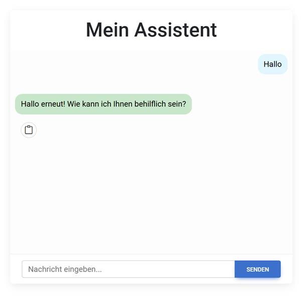

# chatbot-ui-prototype
13.12.2024

# ChatGPT-Style Chatbot: Schritt-für-Schritt-Anleitung

In diesem Blogpost erfährst du, wie du deinen eigenen ChatGPT-ähnlichen Chatbot erstellen kannst – von der Auswahl des passenden Modells bis zur Integration in eine Anwendung. Die Anleitung richtet sich an Einsteiger und fortgeschrittene Entwickler:innen gleichermaßen und bietet praktische Tipps sowie Codebeispiele.

👉 **Lesen Sie den vollständigen Artikel hier:** [Baue dir deinen eigenen ChatGPT-Style Chatbot – Eine Schritt-für-Schritt-Anleitung](https://enricobunde.wordpress.com/2024/12/13/baue-dir-deinen-eigenen-chatgpt-style-chatbot-eine-schritt-fur-schritt-anleitung/)

## Inhalt
- Einführung in Large Language Models (LLMs)
- Auswahl eines Modells (z. B. OpenAI, Hugging Face)
- Einrichtung der Entwicklungsumgebung
- Feinabstimmung und Training
- Integration in eine Anwendung
- Tipps zur Optimierung und Skalierung

Perfekt für alle, die die Welt der generativen KI erkunden und einen personalisierten Chatbot erstellen möchten. 🚀
